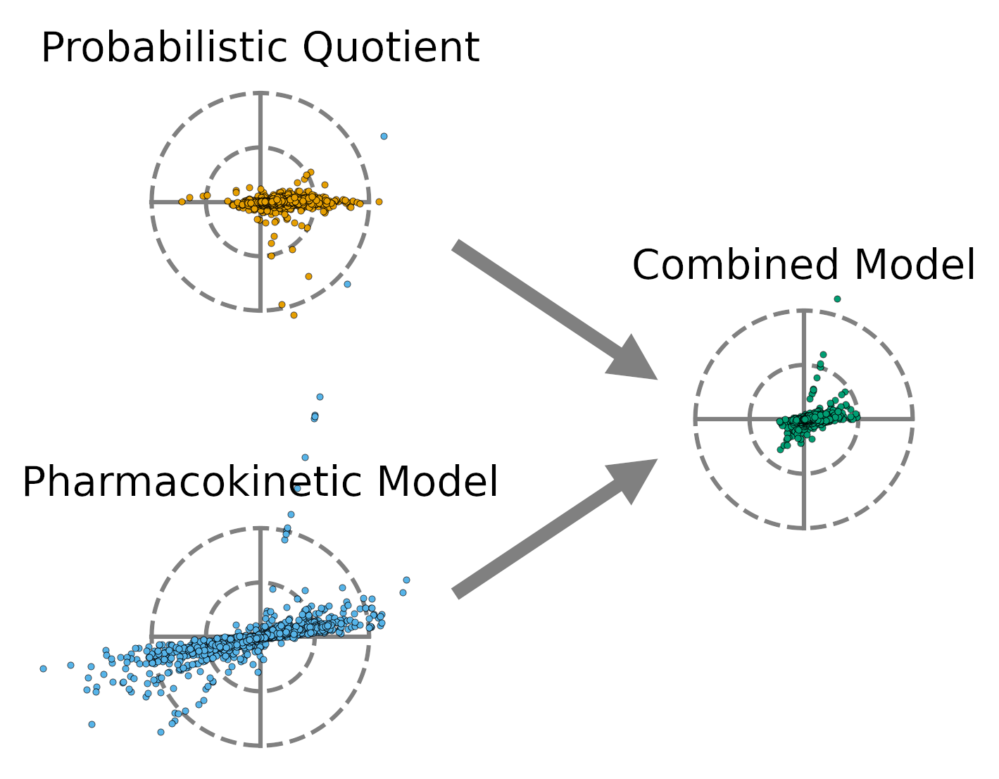

.. Size Effect Normalization documentation master file, created by
   sphinx-quickstart on Tue Jun 28 11:14:51 2022.
   You can adapt this file completely to your liking, but it should at least
   contain the root `toctree` directive.

Welcome to Size Effect Normalization's documentation!
=====================================================

This package is published alongside the paper "Probabilistic quotient's work and
pharmacokinetics' contribution: countering size effect in metabolic time series
measurements" on BMC Bioinformatics |DOI|. The code is published on `GitHub
<https://github.com/Gotsmy/sweat_normalization>`_.

.. |DOI| image:: https://zenodo.org/badge/DOI/10.1007/978-3-319-76207-4_15.svg
   :target: https://doi.org/10.1186/s12859-022-04918-1

.. toctree::
   :maxdepth: 2
   :caption: Contents

   data/Tutorial
   modules

Indices and Tables
==================

* :ref:`genindex`
* :ref:`modindex`
* :ref:`search`
